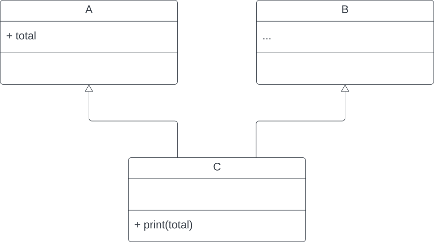
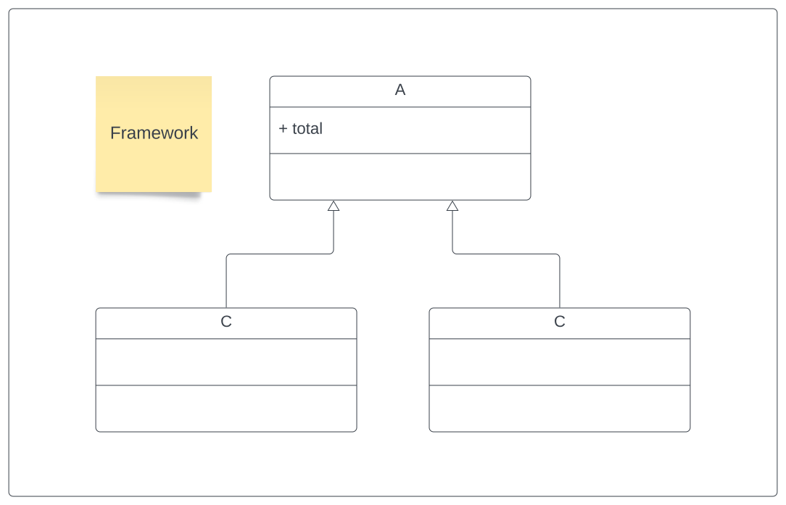
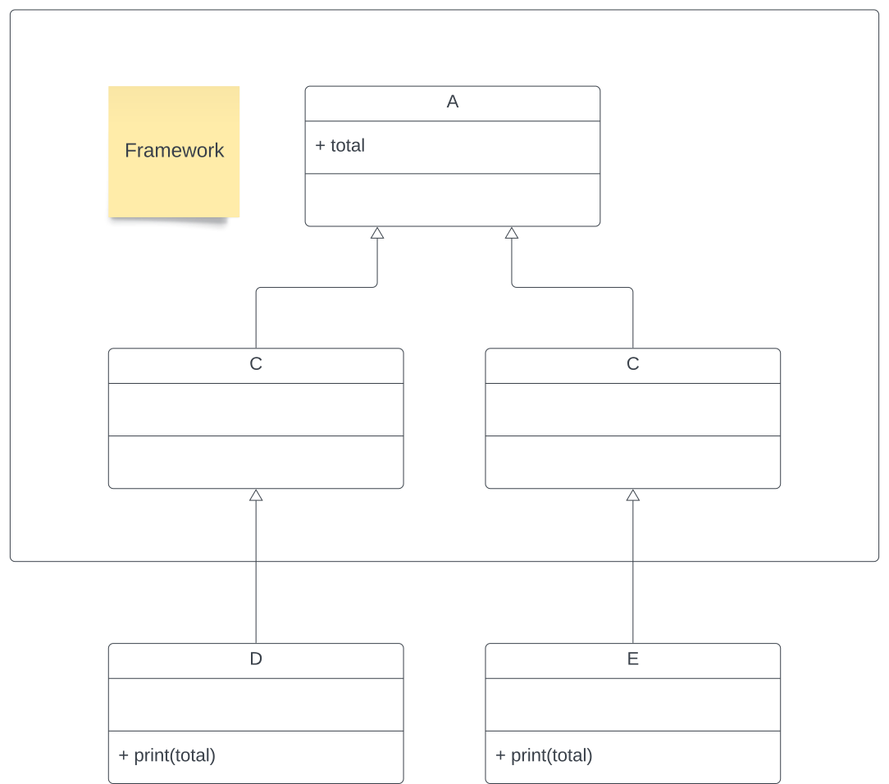
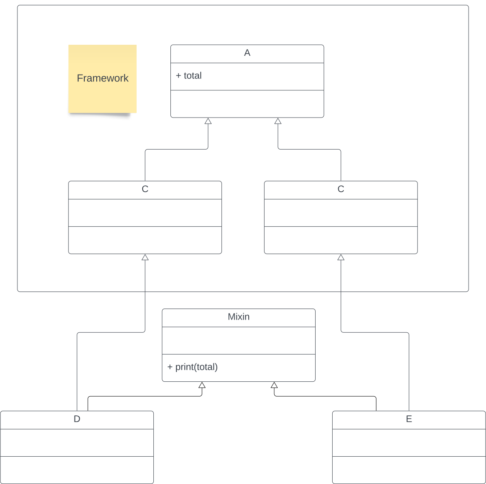

# Multiple Inheritance
When one class inherits not from one but more classes, it's called multiple inheritance.



Here, class C inherits from class A and class B. In what order does class C inherit from class A and B though? Consider the case in which class A and B both have a method called `say_hi()`.


```python
class A:
    def say_hi(self):
        print("Hello from class A.")

class B:
    def say_hi(self):
        print("Hello from class B.")

class C(A, B):
    pass

class D(B, A):
    pass

c = C()
d = D()
c.say_hi()
d.say_hi()
```

    Hello from class A.
    Hello from class B.


As you can see, class C inherited the `say_hi()` method from class A and class D inherited `say_hi()` from class B. This is due to the method resolution order, where Python looks for method definitions across the child class and all its parent classes.


```python
print(C.__mro__)
print(D.__mro__)
```

    (<class '__main__.C'>, <class '__main__.A'>, <class '__main__.B'>, <class 'object'>)
    (<class '__main__.D'>, <class '__main__.B'>, <class '__main__.A'>, <class 'object'>)


# Mixins
What are mixins then? They are a special type of class that aim to solve a specific type of problem. Consider the following class diagram:



Here, we want to use this framework, but we want to adjust the behaviour of class B and C. Let's say we want a method that prints *total* set in class A.

The most straightforward approach could look like this:



This, however, leads to code duplication. A solution involvin a mixin class would look like this instead:



Here, the `print()` method is only defined once, namely in the Mixin class from which class D and E both inherit from (apart from inheriting from B and C, respectively).


```python
# Let's look at the last implementation in code:

# Framework part:
class A:
    total = 42

class B(A):
    pass

class C(A):
    pass

# Own code:
class Mixin:
    def print_total(self):
        print(self.total)

class D(B, Mixin):
    pass

class E(C, Mixin):
    pass

d = D()
e = E()

d.print_total()
e.print_total()
```

    42
    42

